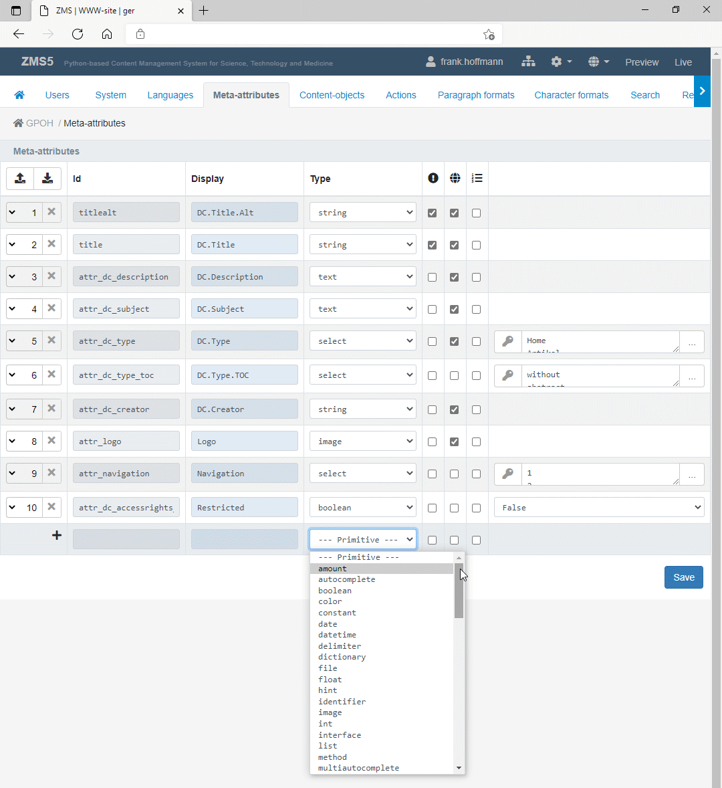

# ZMS Administration: The Configuration Menu
*@work...*

The configuration menu primarily provides ten options for the configuration of the ZMS client:
1. User: managing user accounts and access rights
2. System: system variables, multisite hierarchies, functional components
3. Languages: languages and their editorial dependencies 
4. Meta-Attributes: general content attributes
5. Content-Objects: modelling content classes
6. Paragraph-Formats: text block formats 
7. Character-Formats: text inline formats
8. Actions: additional / self-programmed helper functions
9. Search: configuring content indexing
10. Design: design themes and JS/CSS customization 

****

## Meta-Attributes
Meta attributes ("metas") are a set of general descriptions supporting the automatic processing of content entities (e.g. keyword search). The idea of schematic categorization of content has a long tradition; for web content it started 1994 with the Dublin Core (DC) Metadata Initiative [https://en.wikipedia.org/wiki/Dublin_Core]. ZMS refers to the DC metadata set and provides a minimal list of standard attributes. The ZMS administrator can add further attributes to the list and assign a data type to each of these attributes. In fact, each meta-attribute becomes another data type and extends the list of data types.
Since each content class can use these metas as its own attributes, the entire namespace of the attributes is reduced and template coding becomes easier.


_Administration of metadata_


## Search: Using Zope-ZCatalog
The ZCatalog module provides a simple index for Zope contents. ZMS can address this index by default: the admin menu *Search* allows to select all the content object classes and their attributes to be indexed.
Via *ZCatalog-Connector* tab the Zope objects containing the index are listed and can be administered (by buttons like *Delete*, *Refresh" etc.).


_Administration of metadata to be indexed_


_Administration of the indexer connector_


To show the search functionality in the 3rd view the templates need to provide the following references:
1. location of the search form
2. linking the JavaScript-Libs for asynchronous listing of the search results

First a ZMS document node is needed for showing the search form and the results; this can be an ordinary ZMSDocument object having an ordinary ZMSTextare containing the TAL code for the search form:

```html
<form class="search" method="get">

	<tal:block tal:condition="python:request.get('searchform',True)">
	<input tal:condition="python:request.get('searchform')" type="hidden" name="searchform" tal:attributes="value python:request.get('searchform')" />
	<input tal:condition="python:request.get('lang')" type="hidden" name="lang" tal:attributes="value python:request.get('lang')" />
	<input tal:condition="python:request.get('preview')" type="hidden" name="preview" tal:attributes="value python:request.get('preview')" />
	<legend tal:content="python:here.getZMILangStr('SEARCH_HEADER')">Search header</legend>
	<div class="form-group">
		<div class="col-md-12">
			<div class="input-group">
				<tal:block tal:content="structure python:here.getTextInput(fmName='searchform',elName='search',value=request.get('search',''))">the value</tal:block>
				<span class="input-group-btn">
			<button type="submit" class="btn btn-primary">
				<i class="fa fa-search icon-search"></i>
			</button>
				</span>
			</div>
		</div>
	</div><!-- .form-group -->
	</tal:block>

<div id="search_results" class="form-group" style="display:none">
	<div class="col-md-12">
		<h4 tal:content="python:here.getZMILangStr('SEARCH_HEADERRESULT')">
			Result
		</h4>
		<div class="header row">
			<div class="col-md-12">
				<span class="small-head">
					<span class="glyphicon glyphicon-refresh fas fa-spinner fa-spin" alt="Loading..."></span>
					<tal:block tal:content="python:here.getZMILangStr('MSG_LOADING')">loading</tal:block>
				</span>
			</div>
		</div><!-- .header.row -->
		<div class="line row"></div><!-- .row -->
			<div class="pull-right">
				<ul class="pagination"></ul>
			</div>
	</div>
</div>

</form>
```
The TAL code has two sections:
1. input form 
2. html placeholder for presenting search results and pagination 

The form's request is responded by an XML stream which is transformed into an HTML list by JavaScript. That is why the frontend code need to reference a special, ready to use JS module for handling the search gui:

```html
<script type="text/javascript" charset="UTF-8" src="/++resource++zms_/ZMS/zmi_body_content_search.js"></script>
```

Hint:
The page containing the search form may be linked from different navigation items. Instead of linking the node explicitly it might be easier to reference the page with a "permalink" (as metalement of the ZMS-root node). In the first element of the master template _standard_html_ the link to that page can defined as an object variable like this

```html
<html lang="en" 
	tal:define="zmscontext options/zmscontext;
		search_node python: zmscontext.getLinkObj( zmscontext.getConfProperty( 'ZMS.permalink.search', default='{$@content}'), request);">
```
and a link to the search page can be generated like this;

```html
<a href="#" class="nav-item pr-3" 
	tal:attributes="href python:search_node.getHref2IndexHtml(request)">
	<i class="fas fa-search"></i>&nbsp;
	<span tal:replace="python:zmscontext.getLangStr('SEARCH')">Suche</span>
</a>
```


