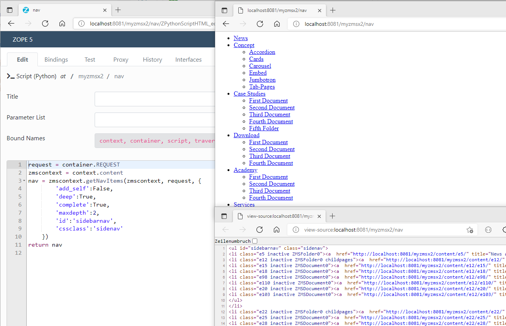

# ZMS Development

## Practical Examples for Using API Functions

### 1. renderShort()
The function `renderShort()` renders a plain view of a content block shown in the ZMI. For page-like container objects this might be just the short title (titlealt) attribute; actually this is what happens by default when you see a sequence of ZMSDocument containers in the ZMI.
For content-containing objects like ZMSTextarea their function `standard_html()` is used as the *renderShort*-view by default.

To any object class defined via ZMS configuration menu a custom `renderShort()` function (primitive type *py* or *zpt*) can be added optionally. This will overwrite its default ZMI view. The following picture shows an enhanced view of the ZMSDocument items followed by a python snippet generating this view:


*Adding a renderShort function as a py-primitive allow you to customize the objects view in the ZMS GUI*

#### Custom Code Example
The code shows the title and the desciption attribute. Conditionally a warning is shown if the editor forgot naming the creator of the document:
```python
## Script (Python) "ZMSDocument.renderShort"
##bind container=container
##bind context=context
##bind namespace=
##bind script=script
##bind subpath=traverse_subpath
##parameters=zmscontext=None,options=None
##title=py: Overwrite renderShort
##
# --// renderShort //--
alert = '<div class="alert alert-warning mx-0">Creator is missing!</div>'
if zmscontext.attr('attr_dc_creator'): 
	alert=''
return '<h1>%s<br/><small>%s</small></h1>%s'%(zmscontext.attr('title'), zmscontext.attr('attr_dc_description'), alert)
# --// /renderShort //--
```

### 2. pathhandler Attribute
Handling of object paths as URL is mainly done by Zope, but some specific details are handled by ZMS. For instance a path addressing a binary file contained by a ZMSFile object: the file itself is uploaded into an object attribute. Usually object attributes cannot be reached directly by URL. Zope handles this by "traversal" (handling URL paths step by step) and in this case the containing object may decide when to deliver the binary data. Usually the ZMSFile object starts publishing the file data, if the URL ends with the file name or its language specific derivatives. This even works if the ZMSFile object is marked as inactive and thus not rendered as a block element on the html page.
If you may want to change this behaviour the `ZMS.pathandler` module offers a *hook* to implant your own code dealing with traversal of the URL path.
So simply add your own _pathhandler_ attribute (python type, "py") to the ZMSFile object class definition like this: 
```python
## Script (Python) "ZMSFile.pathhandler"
##bind container=container
##bind context=context
##bind namespace=
##bind script=script
##bind subpath=traverse_subpath
##parameters=zmscontext=None,options=None
##title=py: Path-Handler
##
# --// pathhandler //--
request = container.REQUEST
if zmscontext.isActive(request):
	return zmscontext.attr('file')
else:
	return False
# --// /pathhandler //--
```
Now ZMS.pathhandler will executes this attribute code when traversing the URL path: the file will only be returned if the ZMSFile object is marked as active.


*ZMSFile content object definition: Adding a pathhandler function as a py-primitive allow you to customize the response on URL pathes*


### 3. getNavItems()
*getNavItems()* allows a quick and simple creation of a navigation. It generates a HTML output as a hierarchical list if li>a elements with a set of helpful css classes:
1. ZMS-ID
2. Meta-ID
3. in/active 
2. current (if current document node)
4. childpages (if sub documents exists)

The functon parameters are
1. document context
2. request
3. parameter dictionary
	- I{id} (C{str=''}) id of base ul-element
	- I{cssclass} (C{str=''}) css class of base ul-element
	- I{add_self} (C{boolean=False}) add self to list
	- I{deep} (C{boolean=True}) process child nodes
	- I{complete} (C{boolean=False}) process complete subtree
	- I{maxdepth} (C{int=100}) limits node list to a given depth
	- I{getrestricted} (C{boolean=True}) get is restricted

```python
request = container.REQUEST
zmscontext = context.content
nav = zmscontext.getNavItems(zmscontext, request, {
		'add_self':False,
		'deep':True,
		'complete':True,
		'maxdepth':2,
		'id':'sidebarnav',
		'cssclass':'sidenav'
	})
return nav
```


*Example code: a Zope Python Script object creating a two level list of the document tree*

The corresponding TAL-code looks like this:

```html
<nav aria-label="context-navigation" 
	tal:content="structure python: zmscontext.getNavItems(zmscontext, request, {
		'add_self':False,
		'deep':True,
		'complete':True,
		'maxdepth':2,
		'id':'sidebarnav',
		'cssclass':'sidenav'
	})"></nav>
```

