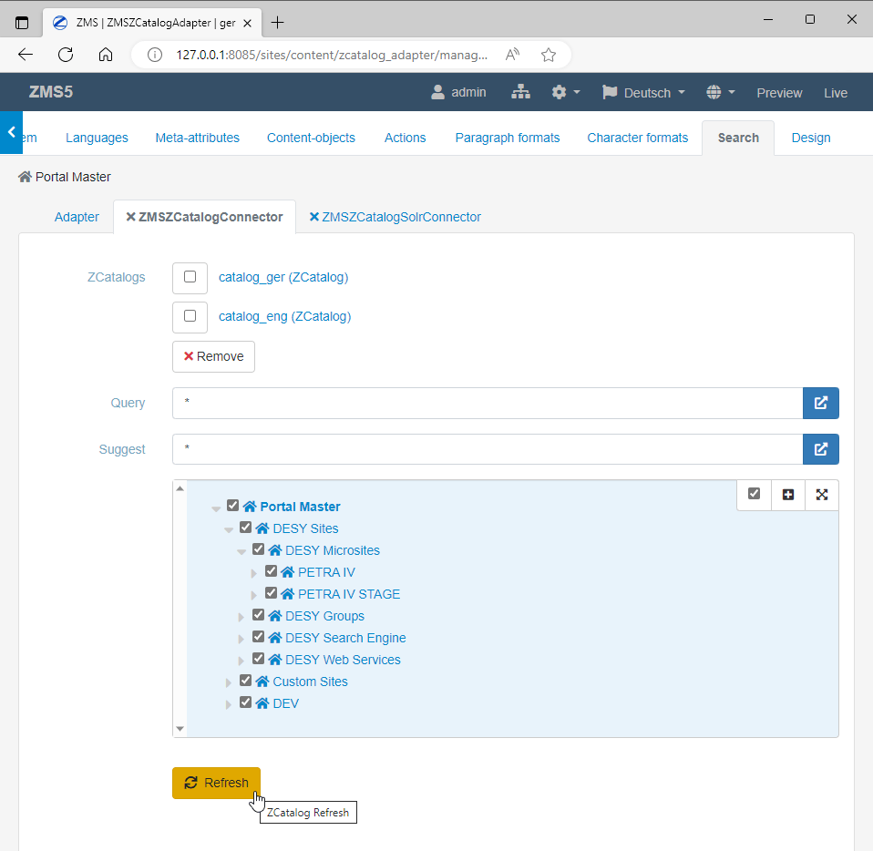

# ZMS Development

## Practical Examples for Using API Functions

### 1. renderShort()
The function `renderShort()` renders a plain view of a content block shown in the ZMI. For page-like container objects this might be just the short title (titlealt) attribute; actually this is what happens by default when you see a sequence of ZMSDocument containers in the ZMI.
For content-containing objects like ZMSTextarea their function `standard_html()` is used as the *renderShort*-view by default.

To any object class defined via ZMS configuration menu a custom `renderShort()` function (primitive type *py* or *zpt*) can be added optionally. This will overwrite its default ZMI view. The following picture shows an enhanced view of the ZMSDocument items followed by a python snippet generating this view:


*Adding a renderShort function as a py-primitive allow you to customize the objects view in the ZMS GUI*

#### Custom Code Example
The code shows the title and the desciption attribute. Conditionally a warning is shown if the editor forgot naming the creator of the document:
```
## Script (Python) "ZMSDocument.renderShort"
##bind container=container
##bind context=context
##bind namespace=
##bind script=script
##bind subpath=traverse_subpath
##parameters=zmscontext=None,options=None
##title=py: Overwrite renderShort
##
# --// renderShort //--
alert = '<div class="alert alert-warning mx-0">Creator is missing!</div>'
if zmscontext.attr('attr_dc_creator'): 
    alert=''
return '<h1>%s<br/><small>%s</small></h1>%s'%(zmscontext.attr('title'), zmscontext.attr('attr_dc_description'), alert)
# --// /renderShort //--
```

### 2. Using Zope-ZCatalog Search
The ZCatalog mmodule provides a simple index for Zope contents. ZMS can address this index by default: the admin menu "Search" allows to select all the content object classes and their attributes to be indexed.
Via "ZCatalog-Connector" tab the Zope objects containing the index are listed and can be administered (delete, refresh etc.).


_Administration of metadata to be indexed_


_Administration of the indexer connector_


To show the search functionality in the 3rd view the templates need to provide the following references:
1. location of the search form
2. linking the JavaScript-Libs for asynchronous listing of the search results

First a ZMS document node is needed for showing the search form and the results; this can be an ordinary ZMSDocument object having an ordinary ZMSTextare containing the TAL code for the search form:

```
<form class="search" method="get">

	<tal:block tal:condition="python:request.get('searchform',True)">
	<input tal:condition="python:request.get('searchform')" type="hidden" name="searchform" tal:attributes="value python:request.get('searchform')" />
	<input tal:condition="python:request.get('lang')" type="hidden" name="lang" tal:attributes="value python:request.get('lang')" />
	<input tal:condition="python:request.get('preview')" type="hidden" name="preview" tal:attributes="value python:request.get('preview')" />
	<legend tal:content="python:here.getZMILangStr('SEARCH_HEADER')">Search header</legend>
	<div class="form-group">
		<div class="col-md-12">
			<div class="input-group">
				<tal:block tal:content="structure python:here.getTextInput(fmName='searchform',elName='search',value=request.get('search',''))">the value</tal:block>
				<span class="input-group-btn">
			<button type="submit" class="btn btn-primary">
				<i class="fa fa-search icon-search"></i>
			</button>
				</span>
			</div>
		</div>
	</div><!-- .form-group -->
	</tal:block>

<div id="search_results" class="form-group" style="display:none">
	<div class="col-md-12">
		<h4 tal:content="python:here.getZMILangStr('SEARCH_HEADERRESULT')">Result</h4>
		<div class="header row">
			<div class="col-md-12">
				<span class="small-head">
					<span class="glyphicon glyphicon-refresh fas fa-spinner fa-spin" alt="Loading..."></span>
					<tal:block tal:content="python:here.getZMILangStr('MSG_LOADING')">loading</tal:block>
				</span>
			</div>
		</div><!-- .header.row -->
		<div class="line row"></div><!-- .row -->
			<div class="pull-right">
				<ul class="pagination"></ul>
			</div>
	</div>
</div>

</form>
```
The TAL code has two sections:
1. input form 
2. html placeholder for presenting search results and pagination 

The form's request is responded by an XML stream which is transformed into an HTML list by JavaScript. That is why the frontend code need to reference a special, ready to use JS module for handling the search gui:

```
<script type="text/javascript" charset="UTF-8" src="/++resource++zms_/ZMS/zmi_body_content_search.js"></script>
```

Hint:
The page containing the search form may be linked from different navigation items. Instead of linking the node explicitly it might be easier to reference the page with a "permalink" (as metalement of the ZMS-root node). In the first element of the master template _standard_html_ the link to that page can defined as an object variable like this

```
<html tal:define="
...
search_node python: zmscontext.getLinkObj( zmscontext. getConfProperty( 'ZMS.permalink.search', default='{$@content}'), request);
...
```
and a link to the search page can be generated like this;

```
<a href="#" class="nav-item pr-3" tal:attributes="href python:search_node.getHref2IndexHtml(request)"><i class="fas fa-search"></i>&nbsp;<span tal:replace="python:zmscontext.getLangStr('SEARCH')">Suche</span></a>
```

