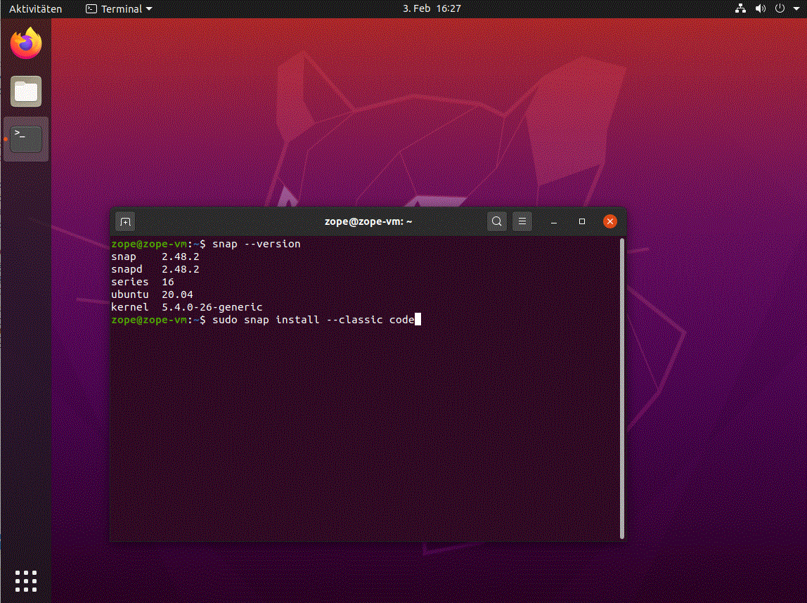
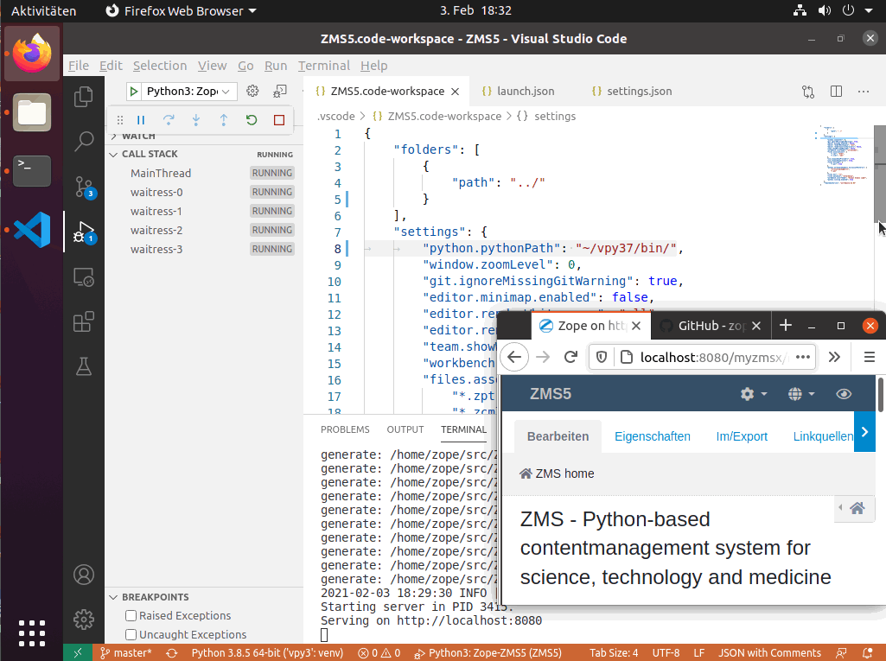

# ZMS Installation

## Prerequisites
The following setup is working on Ubuntu 20.4. and will run in a similar way on other unix-like operating systems (as well as *Windows Sublinux*, WSL). It is recomended to add a special non-root user like _zope_ for running the zope application server.
ZMS needs a Python version 3.6+; please check your installed python version
```
~$: python3 --version
```
and update or reinstall Python3, if it is missing or a former Python version is installed.
ZMS is running on Zope (Version 5+) as the underlaying Python3 application server. The ZMS setup routine automatically installs Zope. Zope needs some basic OS packages for communication and compiling; the following packages should be installed on your system:
```
~$: sudo apt-get install gcc
~$: sudo apt-get install openssh-server
~$: sudo apt-get install build-essential 
~$: sudo apt-get install libssl-dev libffi-dev 
~$: sudo apt-get install python3-dev
~$: sudo apt-get install python3-venv
~$: sudo apt-get install git
```
## 1. Setup virtual Python environment
The first step is to setup a virtual Python environment which is a kind of copy of the primary Python installation which easily can be extended or replaced. The following example places the virtual environment into the home-folder of user _zope_:
```
~$: python3 -m venv /home/zope/vpy3
```
## 2. Install ZMS into the virtual Python environment
After changing to the `bin`-folder of the installed virtual environment, simply install ZMS with `pip` from the ZMS-github-master: https://github.com/zms-publishing/ZMS5
```
~$: cd /home/zope/vpy3/bin/
~$: ./pip install https://github.com/zms-publishing/ZMS5/archive/master.zip
```
## 3. Add new Zope instance
After the ZMS installation the bin-folder of the virtual environment contains a lot of new scipts. Please use `mkwsgiinstance` to generate an new zope-instance, named zms5_dev as an example:
```
~$: ./mkwsgiinstance -d /home/zope/instance/zms5_dev
```
More: https://zope.readthedocs.io/en/latest/operation.html#creating-a-zope-instance

## 4. Start Zope server (default port 8080)
```
~$: ./runwsgi -v /home/zope/instance/zms5_dev/etc/zope.ini
```
More: https://zope.readthedocs.io/en/latest/operation.html#running-zope

## 5. Add a new ZMS node into Zope object tree
The _add menu_ is located in the Zope top bar. Please select the object type 'ZMS' to add a new ZMS node into the Zope object tree. After initializing the new ZMS node you will change to the ZMS-GUI and see a default content tree:


*Adding a an ZMS instance and getting a first glance of the ZMS GUI*

<br/>

# Working with Visual Studio Code
## Installation & Setup of Visual Studio Code
[Visual Studio Code](https://code.visualstudio.com/) (VSCode) is a free source-code editor made by Microsoft for Windows, Linux and macOS - and a perfect environment for developing ZMS websites.
After completing the standard installation of VSCode at least two helpful **extensions** should be added:

1. [Python](https://marketplace.visualstudio.com/items?itemName=ms-python.python) for syntax highlighting and debugging Python code
2. [Remote Development Extension Pack](https://marketplace.visualstudio.com/items?itemName=ms-vscode-remote.vscode-remote-extensionpack) for getting SSH-connections to  remote servers, VMs or the Sublinux on your Windows 10 machine.

On linux You can install VSCode by running:
```
sudo snap install --classic code
```


ZMS contains a basic set of customizable VSCode JSON config files for the workspace and for running Zope/ZMS in the debugging mode:
```
.vscode
	ZMS5.code-workspace
	launch.json
	settings.json
```

### ZMS5.code-workspace
[ZMS5.code-workspace](https://github.com/zms-publishing/ZMS5/blob/master/.vscode/ZMS5.code-workspace) defines some workspace parameters like
+ shown folders
+ python path
+ files associations
+ invisible files
+ VSCode theme & icons

### settings.json
In our enviroment the only enty in [settings.json](https://github.com/zms-publishing/ZMS5/blob/master/.vscode/settings.json) tells VSCode where to expect the python executable. This should be the one of the virtual python (and not the primary python installation)

### launch.json
The file [launch.json](https://github.com/zms-publishing/ZMS5/blob/master/.vscode/launch.json) ist the most important config file bedause it tells VSCode how the Python extension will start the debugger. So all relevant paths must be mentioned, especially the starting `programm` and the `env`ironment variables Zope needs for starting a Zope instance. The following example config file assumes that 
1. there is a user `zope` using the home folder as a location for the virtual python (`~/vpy3/`) and the zope instances (`~/instance/`)
2. the name of the Zope instance is `zms5_dev`
3. the git-cloned code of Zope and ZMS are placed in a source folder called `~/src`

```
{
	"configurations": [
		{
			"name": "Python3: Zope-ZMS5",
			"type": "python",
			"request": "launch",
			"program": "~/src/Zope/src/Zope2/Startup/serve.py",
			"justMyCode": false,
			"console": "integratedTerminal",
			"args": [
				"-d",
				"-v",
				"~/instance/zms5_dev/etc/zope.ini"
			],
			"env": {
				"PYTHONUNBUFFERED":"1",
				"CONFIG_FILE": "~/instance/zms5_dev/etc/zope.ini",
				"INSTANCE_HOME": "~/instance/zms5_dev",
				"CLIENT_HOME": "~/instance/zms5_dev",
				"PYTHON": "~/vpy37/bin/python",
				"SOFTWARE_HOME": "~/vpy37/bin/"
			},
		},
	]
}
```
If the paths in the config file corresponds to the ones of development machine you can start Zope with Python debugger via the configuration item "Python3: Zope-ZMS5" in the debug menu of VSCode. The Zope server can be addressed in a web browser via `http://localhost:8080`. The environment will look like this:

