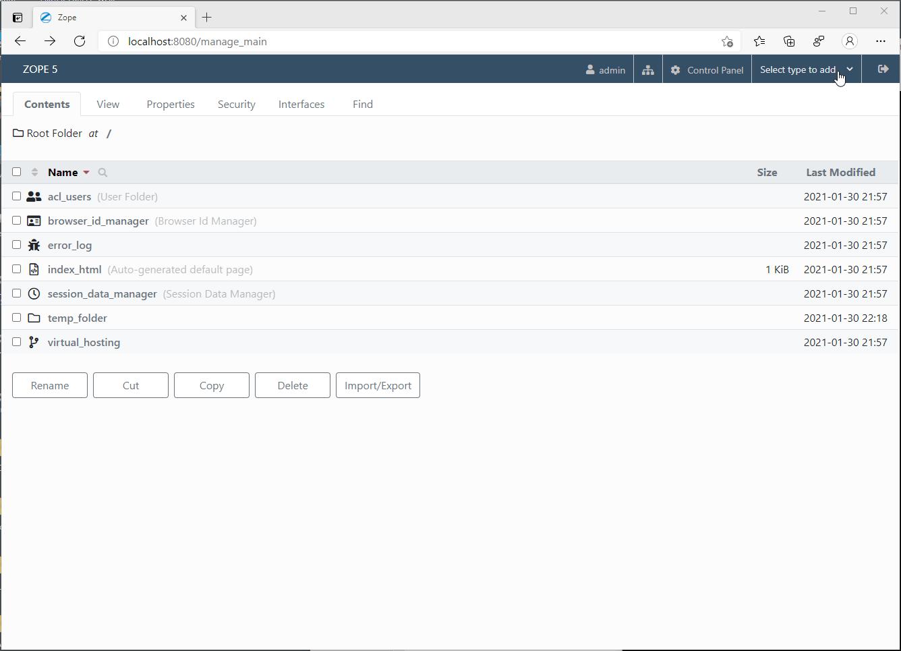

# Installation

## Prerequisites
The following setup is working on Ubuntu 20.4. and will run in a similar way on other operation systems. It is recomended to add a special non-root user like _zope_ for running the zope application server.
ZMS needs a Python version 3.6+; please check your installed python version
```
~$: python3 --version
```
and update or reinstall Python3, if it is missing or a former Python version is installed.
ZMS is running on Zope (Version 5+) as the underlaying Python3 application server. The ZMS setup routine automatically installs Zope. Zope needs some basic OS packages for communication and compiling; the following packages should be installed on your system:
```
~$: sudo apt-get install gcc
~$: sudo apt-get install openssh-server
~$: sudo apt-get install build-essential libssl-dev libffi-dev python3-dev
~$: sudo apt-get install python3-venv
~$: sudo apt-get install git
```
## 1. Setup virtual Python environment
The first step is to setup a virtual Python environment which is a kind of copy of the primary Python installation which easily can be extended or replaced. The following example places the virtual environment into the home-folder of user _zope_:
```
~$: python3 -m venv /home/zope/vpy3
```
## 2. Install ZMS into the virtual Python environment
After changing to the `bin`-folder of the installed virtual environment, simply install ZMS with `pip` from the ZMS-github-master: https://github.com/zms-publishing/ZMS5
```
~$: cd /home/zope/vpy3/bin/
~$: ./pip install https://github.com/zms-publishing/ZMS5/archive/master.zip
```
## 3. Add new Zope instance
After the ZMS installation the bin-folder of the virtual environment contains a lot of new scipts. Please use `mkwsgiinstance` to generate an new zope-instance, named zms5_dev as an example:
```
~$: ./mkwsgiinstance -d /home/zope/instance/zms5_dev
```
More: https://zope.readthedocs.io/en/latest/operation.html#creating-a-zope-instance

## 4. Start Zope server (default port 8080)
```
~$: ./runwsgi -v /home/zope/instance/zms5_dev/etc/zope.ini
```
More: https://zope.readthedocs.io/en/latest/operation.html#running-zope

## 5. Add a new ZMS node into Zope object tree
The _add menu_ is located in the Zope top bar. Please select the object type 'ZMS' to add a new ZMS node into the Zope object tree. After initializing the new ZMS node you will change to the ZMS-GUI and see a default content tree:


